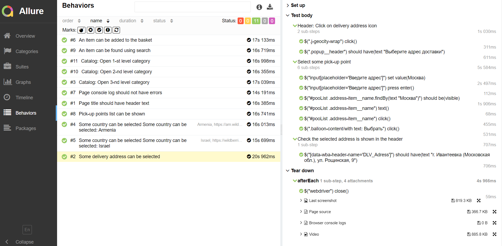

## Проект по автоматизации тестирования интернет-магазина Wildberries
> <a target="_blank" href="https://www.wildberries.ru/">Ссылка на главную страницу сайта</a>

## :page_facing_up: Содержание:
- <a href="#computer-технологии-и-инструменты">Технологии и инструменты</a>
- <a href="#black_nib-реализованные-проверки">Реализованные проверки</a>
- <a href="#electric_plug-сборка-в-jenkins">Сборка в Jenkins</a>
- <a href="#arrow_forward-запуск-из-терминала">Запуск из терминала</a>
- <a href="#open_book-allure-отчет">Allure отчет</a>
- <a href="#-отчет-в-telegram">Отчет в Telegram</a>
- <a href="#-видео-пример-прохождения-теста">Видео пример прохождения теста</a>

## :computer: Технологии и инструменты
<p align="center">


</p>


## :black_nib: Реализованные проверки
- Наличие заголовка на главной странице
- Проверка функциональности поисковой строки
- Проверка возможности открыть в каталоге категории различных уровней вложенности
- Проверка добавления товара в корзину
- Проверка выбора страны в заголовке страницы
- Проверка выбора адреса доставки в заголовке страницы
- Проверка возможности просмотреть список пунктов выдачи
- Проверка на наличие ошибок в console log

## :electric_plug: Сборка в Jenkins
### <a target="_blank" href="https://www.wildberries.ru/">Сборка в Jenkins</a>
*Для запуска сборки необходимо указать значения параметров и нажать кнопку <code><strong>*Собрать с параметрами*</strong></code>.*
<p align="center">

</p>

### Параметры сборки в Jenkins:
Сборка в Jenkins
- browser (браузер, по умолчанию chrome)
- size (размер окна браузера, по умолчанию 1920x1080)
- необходимо добавить файл resources/config/remote.properties (по примеру local.properties)

## :arrow_forward: Запуск из терминала
Локальный запуск:
```
gradle clean test
```

Удаленный запуск:
```
clean
test
-Dbrowser=${BROWSER}
-Dsize=${BROWSER_SIZE}
```

## :open_book: Allure отчет
- ### Главный экран отчета
<p align="center">

</p>

- ### Страница с проведенными тестами
<p align="center">

</p>

- ### Основной дашборд
<p align="center">


</p>

##  Отчет в Telegram

> После завершения сборки бот, созданный в <code>Telegram</code>, автоматически обрабатывает и отправляет сообщение с отчетом.
<p align="center">

</p>

##  Видео пример прохождения теста
> К каждому тесту в отчете прилагается видео. Одно из таких видео представлено ниже.
>
https://user-images.githubusercontent.com/103368614/173416855-a19498b8-752c-4e30-8a05-c5c5af154d8d.mp4
